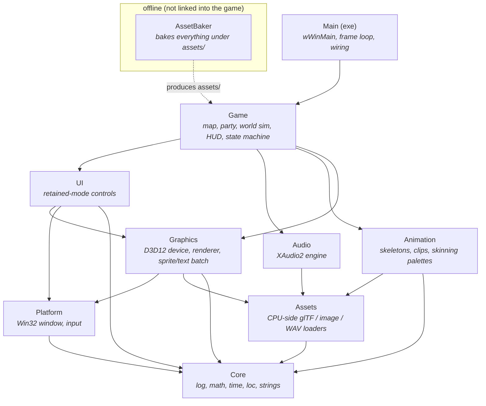
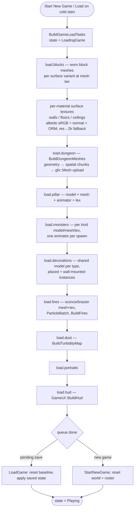
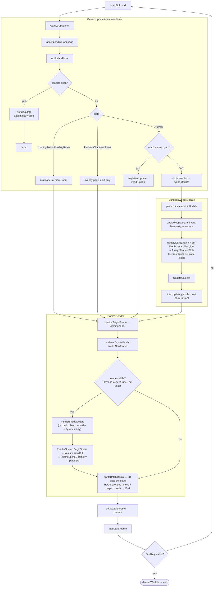

# Dungeon — Architecture Diagrams

Four views of the system. The Mermaid blocks below are the canonical source
(they render inline on GitHub); a matching set of standalone SVGs is exported
alongside for embedding elsewhere. See `ARCHITECTURE.md` for the prose version.

1. [Module block view](#1-module-block-view) — the static-library layering.
2. [Startup](#2-startup) — from `wWinMain` to the landing menu.
3. [Level load](#3-level-load) — the staged load behind the progress screen.
4. [Per-frame](#4-per-frame) — one iteration of the main loop.

## Exported SVGs

Self-contained renders of the same four diagrams (dark-theme fallback colors
baked in, so they display standalone in a browser or doc tool). Regenerate these
if you change the Mermaid source below.

| Diagram | SVG |
|---------|-----|
| Module block view | [diagram_modules.svg](diagram_modules.svg) |
| Startup | [diagram_startup.svg](diagram_startup.svg) |
| Level load | [diagram_level_load.svg](diagram_level_load.svg) |
| Per-frame | [diagram_per_frame.svg](diagram_per_frame.svg) |

---

## 1. Module block view

Nine strictly-layered static libs plus the exe. Dependencies flow downward only
(a module may use modules below it, never sideways or upward). Data flows up
through plain structs (e.g. `assets::MeshData` → `gfx::Mesh`).



---

## 2. Startup

`wWinMain` builds the engine modules, constructs `Game` (which parses the map
files in its member initializers and registers the dev console), then the loop
runs the *boot* load tasks one-per-frame behind a progress screen. The boot
list is the bare minimum to reach the landing menu fast — the dungeon itself is
not loaded until the player starts a game (see diagram 3).

```mermaid
sequenceDiagram
    participant OS
    participant Main as wWinMain
    participant Dev as GraphicsDevice
    participant Game
    participant World as DungeonWorld
    participant UI as GameUI
    participant Loop as main loop

    OS->>Main: launch
    Main->>Main: AllocConsole (debug only)
    Main->>Main: Window(desc)
    Main->>Dev: GraphicsDevice / Renderer / SpriteBatch / AudioEngine
    Main->>Game: construct
    activate Game
    Note over World: member init parses<br/>level1.map + level1.ent,<br/>builds Party, seeds fog, sets ambient
    Game->>Game: settings.Load() + ApplyLanguage()
    Game->>Game: CreateDefaultParty() + ApplyPartySpeed()
    Game->>Game: wire callbacks (world↔UI↔state machine)
    Game->>Game: register dev-console commands
    Game->>UI: BuildStaticUi() (theme, menu, pause, sheet)
    Game->>Game: BuildBootLoadTasks() (sounds, title art)
    deactivate Game
    Main->>Loop: enter (state = Loading)
    loop one task per frame, behind progress screen
        Loop->>Game: Update(dt) → RunLoadTasks()
        Game->>Game: load.echoes (SoundBank)
        Game->>UI: load.title_art
    end
    Loop->>Game: tasks done → state = Menu
    Note over Loop: landing page (baked title art + MenuList)
```

---

## 3. Level load

Triggered the first time the player picks **Start New Game** or **Continue/Load**
on a cold start: `BuildGameLoadTasks()` queues `DungeonWorld::AppendLoadTasks`
plus portraits and the HUD, and the state goes to `LoadingGame`. Each task is
one frame of blocking work behind the descending-progress screen. When the queue
drains, the game either starts fresh or applies the pending save, then enters
`Playing`.



> The same path serves the **quality hot-swap** (`ApplyQuality`) and **map edits**
> (`EditCell → RebuildGeometry`): both `WaitIdle` then re-run `LoadDungeonBlocks`
> / `BuildDungeonMeshes` in place.

---

## 4. Per-frame

One iteration of the `wWinMain` loop. `Game::Update` is a state machine that
routes input; the dev console and map overlay are *overlays* (not states) that
intercept input while the world keeps simulating. `Game::Render` does the 3D
passes (only while a scene is visible) then a single 2D sprite/text pass.


